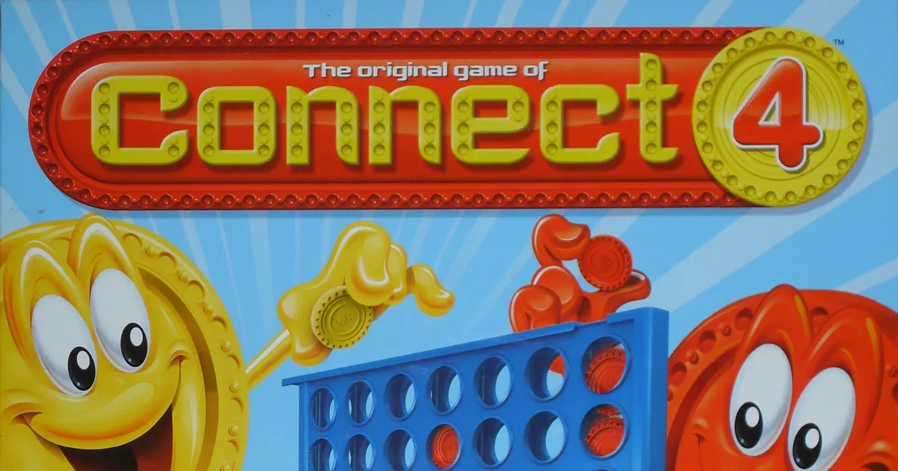
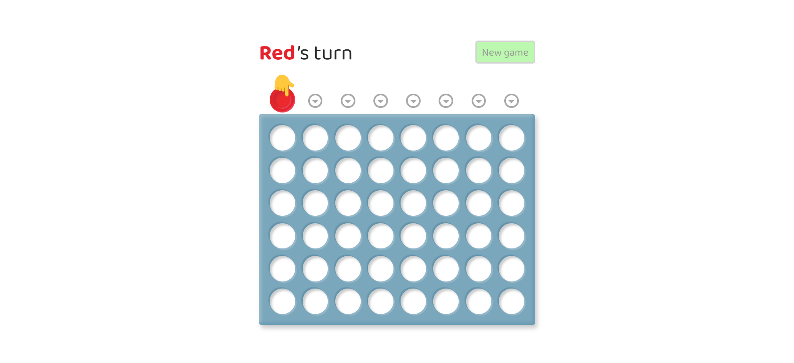

# Connect Four Game

Welcome to the Connect Four game! This project is a web-based implementation of the classic Connect Four game, developed using HTML, CSS, and JavaScript (Vue.js). The game allows two players to take turns dropping pieces into a grid, aiming to connect four of their pieces in a row either horizontally, vertically, or diagonally.

## Features

- Two-player gameplay (Red vs. Yellow).
- Interactive and responsive UI.
- Winning and draw detection.
- Option to start a new game.
- Visual indicators for the current player's turn.
- Keyboard navigation support.

## Table of Contents

- [Demo](#demo)
- [Installation](#installation)
- [Usage](#usage)
- [Game Rules](#game-rules)
- [Contributing](#contributing)
- [License](#license)

## Demo

You can try out the live demo of the game [here](https://smitparekh84.github.io/Connect-Four-Game/).

## Installation

To run the game locally, follow these steps:

1. **Clone the repository:**
   ```bash
   git clone https://github.com/SmitParekh84/Connect-Four-Game.git
   cd connect-four
   ```

2. **Open the project in your preferred code editor:**

3. **Run the game:**
   Open `index.html` in your web browser.

## Usage

1. Open `index.html` in your web browser.
2. The game board will be displayed, and the game will start with Red's turn.
3. Click on a column to drop a piece.
4. The turn switches to the other player after a piece is dropped.
5. The game announces the winner or a draw when the game ends.
6. Click the "New game" button to start a new game.

## Game Rules

- Players take turns to drop their colored pieces into one of the columns.
- The piece will occupy the lowest available slot within the column.
- The objective is to connect four of your pieces in a row - vertically, horizontally, or diagonally.
- The game ends when a player connects four pieces or when the board is full, resulting in a draw.

## Project Structure

```plaintext
├── assets
│   ├── css
│   │   └── style.css        # Stylesheet for the game
│   ├── images
│   │   └── Logo.png         # Game logo
│   └── scripts
│       └── script.js        # JavaScript logic for the game
├── index.html               # Main HTML file
└── README.md                # Readme file
```

## Contributing

Contributions are welcome! If you'd like to contribute to this project, please follow these steps:

1. Fork the repository.
2. Create a new branch (`git checkout -b feature-branch`).
3. Make your changes.
4. Commit your changes (`git commit -am 'Add new feature'`).
5. Push to the branch (`git push origin feature-branch`).
6. Create a new Pull Request.

## License

This project is licensed under the MIT License. See the [LICENSE](LICENSE) file for more details.

---

&copy; Copyright by Smit Parekh ❤️

Feel free to reach out if you have any questions or feedback!
